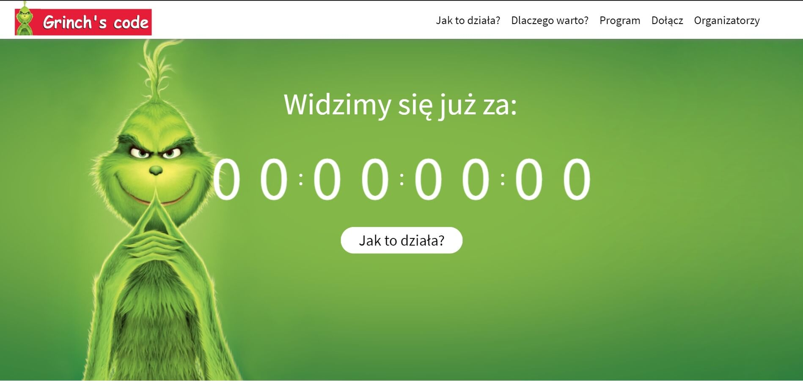

# Grinch's Code
Hackathon landing page

## Table of contents
* [Live](#live)
* [Technologies](#technologies)
* [Setup](#setup)

## Live
[grinchscode.pl](http://grinchscode.pl/)

## Technologies
Project is created with:
* React
* SASS

## Setup
This project was bootstrapped with [Create React App](https://github.com/facebook/create-react-app).
To run this project, install it locally using [npm](https://www.npmjs.com):

### Available Scripts

In the project directory, you can run:

### `npm i`

Installs the necessary packages

#### `npm start`

Runs the app in the development mode. 
Open [http://localhost:3000](http://localhost:3000) to view it in the browser.
